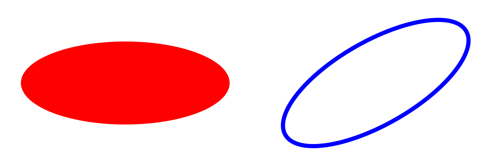
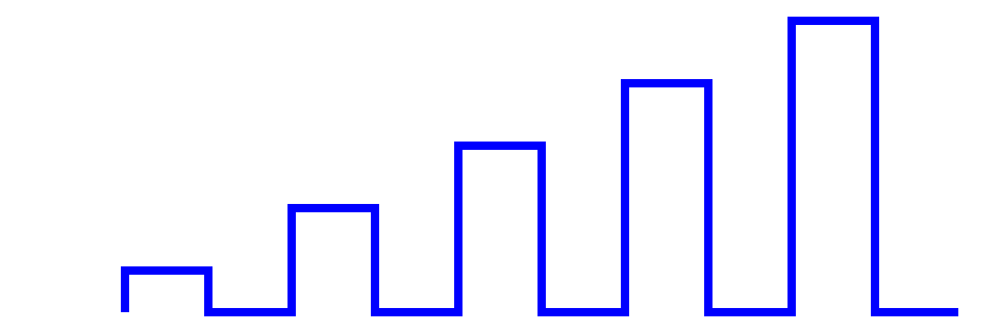
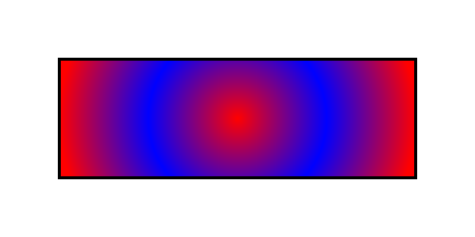
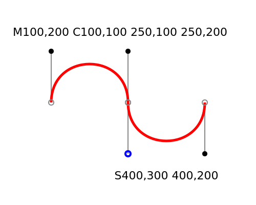
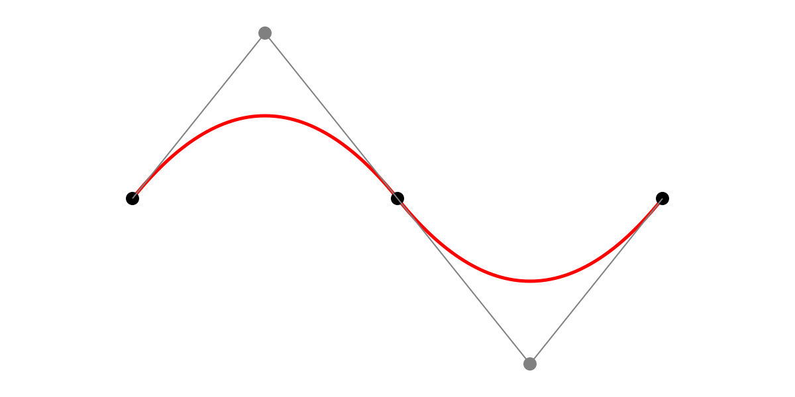
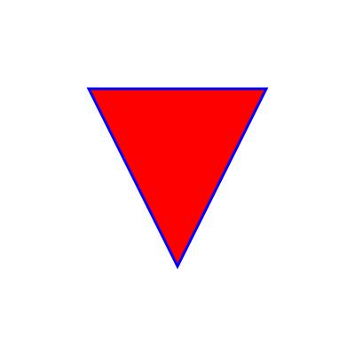

# Examples

## basic_circle

View the code [here](./examples/basic_circle.mo)

## basic_ellipse

View the code [here](./examples/basic_ellipse.mo)

## basic_line

View the code [here](./examples/basic_line.mo)

## basic_polygon

View the code [here](./examples/basic_polygon.mo)

## basic_polyline

View the code [here](./examples/basic_polyline.mo)

## basic_rect

View the code [here](./examples/basic_rect.mo)

## basic_rect_2

View the code [here](./examples/basic_rect_2.mo)

## gradient_linear

View the code [here](./examples/gradient_linear.mo)

## gradient_radial

View the code [here](./examples/gradient_radial.mo)

## image

View the code [here](./examples/image.mo)

## path_arcs

View the code [here](./examples/path_arcs.mo)

## path_cubic

View the code [here](./examples/path_cubic.mo)

## path_quad

View the code [here](./examples/path_quad.mo)

## path_triangle

View the code [here](./examples/path_triangle.mo)

## text_tspan

View the code [here](./examples/text_tspan.mo)
